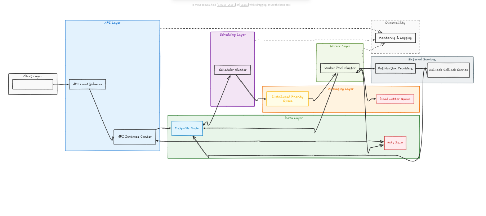

# EXPERT LISTING Distributed Delayed Job & Notification Delivery System

**Author:** Darasimi Kelani  
**Version:** 1.0  
**Status:** Design Proposal

---

## 1. Problem Statement

Build a distributed notification delivery system that:

- Schedules jobs for future delivery (time-based or delay-based)
- Guarantees exactly-once delivery across concurrent workers
- Supports priority ordering (high jobs always before low)
- Retries failed jobs with exponential backoff
- Dead-letters jobs that exhaust retries
- Rate-limits notifications per recipient per hour (excess jobs are deferred, never rejected)
- Fires webhook callbacks on every status change
- Exposes job status and system metrics endpoints
- Scales horizontally without coordination overhead

---

## 2. Why Task Scheduler and Job Executor Are Separate

This is the most important architectural decision in this system.

A single process that both schedules and executes jobs creates a fatal coupling: if the process is busy executing a slow job, it cannot check for newly due jobs. At scale, a backlog of slow jobs would cause time-sensitive notifications to miss their delivery windows silently.

**Task Scheduler** — a lightweight process on a tight polling loop (every 500ms). Its only job is to scan PostgreSQL for due `pending` jobs and promote them into the Redis priority queues. Fast, predictable, stateless.

**Job Executor (Workers)** — a pool of processes that consume from Redis, execute delivery, handle retries, fire webhooks, and update job status. Workers do the slow, failure-prone work. Horizontally scalable and crash-safe.

You can run one scheduler and fifty workers. If workers back up, the scheduler is unaffected. If the scheduler restarts, jobs already in Redis continue processing. The scheduler is the clock. The workers are the hands.

---

## 3. High-Level Architecture



Retries and rate-limit deferrals loop back through PostgreSQL (a `send_at` reset) — the scheduler is the only component that ever enqueues to Redis.

---

## 4. Data Model

### 4.1 jobs

```sql
CREATE TYPE job_status AS ENUM
    ('pending', 'queued', 'claimed', 'sent', 'failed', 'dead_lettered');
CREATE TYPE channel_type AS ENUM ('email', 'sms', 'push');
CREATE TYPE priority_level AS ENUM ('high', 'medium', 'low');

CREATE TABLE jobs (
    id                  UUID PRIMARY KEY DEFAULT gen_random_uuid(),
    recipient           TEXT NOT NULL,
    channel             channel_type NOT NULL,
    payload             JSONB NOT NULL,
    send_at             TIMESTAMPTZ NOT NULL,
    priority            priority_level NOT NULL DEFAULT 'medium',
    status              job_status NOT NULL DEFAULT 'pending',
    attempt_count       INTEGER NOT NULL DEFAULT 0,
    max_attempts        INTEGER NOT NULL DEFAULT 5,
    next_retry_at       TIMESTAMPTZ,
    worker_id           TEXT,
    claimed_at          TIMESTAMPTZ,
    heartbeat_at        TIMESTAMPTZ,
    sent_at             TIMESTAMPTZ,
    failed_at           TIMESTAMPTZ,
    error_message       TEXT,
    callback_url        TEXT,
    created_at          TIMESTAMPTZ NOT NULL DEFAULT NOW(),
    updated_at          TIMESTAMPTZ NOT NULL DEFAULT NOW()
);

CREATE INDEX idx_jobs_scheduler ON jobs (send_at, status) WHERE status IN ('pending', 'failed');
CREATE INDEX idx_jobs_heartbeat ON jobs (heartbeat_at, status) WHERE status = 'claimed';
CREATE INDEX idx_jobs_queued ON jobs (updated_at) WHERE status = 'queued';
CREATE INDEX idx_jobs_recipient ON jobs (recipient, status);
```

**Why `heartbeat_at`?** Workers update it every 10 seconds while processing. If a worker crashes, the scheduler sees `heartbeat_at < NOW() - 30s` on a claimed job and reclaims it. Without this, crashed jobs stay claimed forever.

**Why `worker_id`?** Each worker instance has a unique ID (hostname + PID + suffix). It drives crash detection and the ownership fence (Section 7.8), and makes debugging trivial.

**Why `next_retry_at` on the jobs table?** Retry scheduling is part of the job record, not a separate table — no join on the retry path, and the retry state is visible in a single row.

### 4.2 job_idempotency

```sql
CREATE TABLE job_idempotency (
    idempotency_key TEXT PRIMARY KEY,
    job_id          UUID NOT NULL REFERENCES jobs(id),
    created_at      TIMESTAMPTZ NOT NULL DEFAULT NOW()
);
```

**Why a separate table?** The key is client-provided and may be a natural key (an order ID). One key must map to exactly one job; the primary-key constraint enforces that at the database level with no application-level coordination.

### 4.3 dead_letter_queue

```sql
CREATE TABLE dead_letter_queue (
    id              UUID PRIMARY KEY DEFAULT gen_random_uuid(),
    job_id          UUID NOT NULL REFERENCES jobs(id),
    recipient       TEXT NOT NULL,
    channel         channel_type NOT NULL,
    payload         JSONB NOT NULL,
    attempt_count   INTEGER NOT NULL,
    last_error      TEXT,
    dead_lettered_at TIMESTAMPTZ NOT NULL DEFAULT NOW()
);
```

**Why copy fields from jobs?** The DLQ is terminal and self-contained: support can read it without joining back, and the jobs table can be archived or purged later without losing DLQ data.

### 4.4 webhook_log

One row per webhook attempt: `job_id, callback_url, status_change, payload, http_status, attempt, fired_at`. An audit trail, not a delivery dependency.

### 4.5 Rate limit buckets (Redis, not PostgreSQL)

Key `ratelimit:{recipient}:{YYYYMMDDHH}`, an integer counter with a 2-hour TTL. Rate-limit state is ephemeral by design: if Redis restarts, the worst case is a brief window of over-delivery, not data loss. Keeping it in PostgreSQL would add a write to every delivery attempt — the hottest path in the system.

---

## 5. API Specification

| Endpoint | Purpose |
|---|---|
| `POST /jobs` | Schedule a job → 201; duplicate idempotency key → 409 with `existing_job_id` |
| `GET /jobs/{id}/status` | Status, attempt count, sent_at, error |
| `GET /jobs?status=&limit=` | Recent jobs, newest first (powers the dashboard) |
| `POST /jobs/{id}/retry` | Replay a dead-lettered job: reset attempts, back through the normal promotion path; 409 unless `dead_lettered` |
| `GET /metrics` | Job counts by status |
| `POST /webhook-mock` | Stub receiver for local testing |

```json
POST /jobs
{
    "recipient": "user@example.com",
    "channel": "email",
    "payload": { "subject": "Hello", "body": "World" },
    "send_at": "2025-08-01T10:00:00Z",
    "priority": "high",
    "callback_url": "https://example.com/webhook",
    "idempotency_key": "order-123-confirmation"
}
```

`send_at` and `delay_seconds` are mutually exclusive; `delay_seconds` resolves to `NOW() + delay`.

**`POST /jobs` never returns 429.** Rate limiting is enforced at delivery time (Section 9): excess jobs queue, they do not fail.

**Metrics note:** `GET /metrics` is a `GROUP BY status` query. At scale, replace with Redis counters incremented on every transition, keeping the query as a reconciliation fallback.

Interactive OpenAPI docs are served at `/docs`; a live dashboard (metrics, job table, submission form, DLQ replay) at `/`.

---

## 6. Task Scheduler

One async process, one loop: `promote_due_jobs()` → `recover_stale_claimed_jobs()` → `requeue_stale_queued_jobs()` → sleep 500ms. A failed tick is logged and retried next interval — a transient error must never kill the scheduler, the one process the system cannot lose. Workers apply the same rule.

### 6.1 Promote Due Jobs

```sql
UPDATE jobs SET status = 'queued', updated_at = NOW()
WHERE id IN (
    SELECT id FROM jobs
    WHERE status = 'pending' AND send_at <= NOW() + INTERVAL '5 seconds'
    ORDER BY priority ASC, send_at ASC
    LIMIT 500
    FOR UPDATE SKIP LOCKED
)
RETURNING id, priority, send_at   -- then ZADD each to queue:{priority}
```

**Why `FOR UPDATE SKIP LOCKED`?** Multiple scheduler instances may run for redundancy. `SKIP LOCKED` guarantees two schedulers never promote the same job — each grabs a non-overlapping batch.

**Why a 5-second lookahead?** Clock drift between database and scheduler hosts can be 1-2 seconds in cloud environments. The lookahead absorbs it at the cost of slightly early delivery.

### 6.2 Priority Score

```python
def priority_score(priority: str, send_at: datetime) -> float:
    weights = {"high": 0, "medium": 10_000_000_000, "low": 20_000_000_000}
    return weights[priority] + send_at.timestamp()
```

Composite score: priority weight plus Unix timestamp. A high-priority job always scores below a lower-priority one; within a priority, earlier `send_at` wins. Workers use `ZPOPMIN` (lowest first).

**Why 10 billion?** The weight must dominate the timestamp (~1.7 billion today). A small weight would let a high-priority job due far in the future score above a medium-priority job due in the past. 10 billion exceeds any representable delivery time, and float64 still resolves the score to well under a millisecond.

### 6.3 Stale Job Recovery (Heartbeat Check)

```sql
UPDATE jobs
SET status = 'pending', attempt_count = attempt_count + 1,
    error_message = 'worker died mid-processing (heartbeat timeout)',
    worker_id = NULL, claimed_at = NULL, heartbeat_at = NULL, updated_at = NOW()
WHERE status = 'claimed' AND heartbeat_at < NOW() - INTERVAL '30 seconds'
RETURNING ...   -- jobs at the attempt cap are dead-lettered directly
```

**Why reset to `pending` instead of `queued`?** The scheduler re-evaluates and re-enqueues cleanly; jumping straight to `queued` risks double-enqueue if the job is still in Redis from the dead worker's claim.

**Why increment `attempt_count` on reclaim?** A hard-crashed worker never runs its failure handler. If the reclaim didn't count as an attempt, a poison message that crashes every worker would be retried forever. Counting it makes `max_attempts` the circuit breaker even for hard crashes. The recovery path also deletes the dead worker's Redis lock so the job is immediately re-claimable.

### 6.4 Requeue Rescue (Queued but Not in Redis)

Promotion updates the row to `queued` first and writes to Redis second; a crash between the two strands the job — no longer `pending`, never in Redis. A sweep re-ZADDs any job stuck in `queued` for over 30 seconds (safe: ZADD is idempotent per member; the `idx_jobs_queued` partial index keeps the scan cheap). This also covers Redis losing data despite AOF persistence (Section 10.4).

---

## 7. Worker Pool

Async processes, N concurrent claim/deliver loops, stateless beyond the job in hand. An idle worker sleeps 100ms and polls again; an iteration failure is logged and never kills the loop.

### 7.1 Worker Loop

Claim → process → repeat. All the interesting machinery is in the claim and the outcome handlers below.

### 7.2 Claiming a Job (Exactly-Once)

```python
async def claim_next_job(worker_id):
    for priority in ("high", "medium", "low"):        # high first, always
        popped = await redis.zpopmin(f"queue:{priority}", count=1)   # gate 1
        if not popped:
            continue
        job_id = popped[0][0]

        acquired = await redis.set(f"job:lock:{job_id}", worker_id,
                                   nx=True, ex=60)                    # gate 2
        if not acquired:
            continue

        claimed = await db.fetchrow("""
            UPDATE jobs
            SET status = 'claimed', worker_id = $1,
                claimed_at = NOW(), heartbeat_at = NOW(), updated_at = NOW()
            WHERE id = $2 AND status = 'queued'                       -- gate 3
            RETURNING id
        """, worker_id, job_id)
        if claimed is None:
            await redis.delete(f"job:lock:{job_id}")
            continue

        return job_id
    return None
```

**Why three gates?** `ZPOPMIN` is atomic — only one worker pops each entry. The `SET NX` lock catches the rare case where the same job id appears in a queue twice (scheduler crash mid-promotion). The conditional `status = 'queued'` update is the final arbiter, backed by PostgreSQL row locking. Any one gate is sufficient; together they make duplicate claiming essentially impossible.

### 7.3 Heartbeat

While processing, a concurrent task updates `heartbeat_at` every 10 seconds (conditional on still owning the claim). Death of the process stops the heartbeat; the scheduler reclaims after 30 silent seconds.

**Why 10s/30s?** Three missed heartbeats before reclaim absorbs a network hiccup or slow write without false positives. Worst-case recovery is ~30s + one poll interval — acceptable for a notification system.

### 7.4 Delivery and Outcomes

Delivery is a stub that fails with probability `DELIVERY_FAILURE_RATE`. Before delivering, the worker checks the recipient's rate limit (Section 9) and defers instead of delivering if the window is exhausted. Every outcome — sent, retry, defer, dead-letter — is written with a fenced update (Section 7.8), then the Redis lock is released and the webhook fired.

### 7.5 Success

Mark `sent` (fenced), release the lock, fire the `sent` webhook.

### 7.6 Retry with Exponential Backoff

On failure, `attempt = attempt_count + 1`. At the cap, dead-letter (7.7). Otherwise:

```
delay = BASE_DELAY * 2^(attempt-1)        # 30s, 60s, 120s, 240s
status = 'pending', send_at = next_retry_at = NOW() + delay
```

**Why reset `send_at`?** The scheduler promotes jobs where `send_at <= NOW()`, so the retry rides exactly the same promotion path as a new job. No special retry queue, no separate retry worker — the scheduler remains the only thing that ever enqueues.

### 7.7 Dead-Letter

The status update to `dead_lettered` and the DLQ insert commit in a single transaction — a job can never be marked dead-lettered without a matching DLQ row. The update is fenced: a worker passes its own `worker_id`, the scheduler's recovery path passes `NULL` for the job it has just reset. Then the `dead_lettered` webhook fires. Manual replay is `POST /jobs/{id}/retry`.

### 7.8 Ownership Fencing (Zombie Workers)

Every terminal transition is conditional on the caller still owning the job (`worker_id = <mine> AND status = 'claimed'`).

**Why?** The heartbeat timeout declares a worker dead after 30 silent seconds — but a worker can be silent without being dead: a GC pause, a network partition, a suspended VM. The scheduler reclaims its job, another worker picks it up, and then the original *wakes up* and finishes its stale work. Unfenced, that zombie's `UPDATE` would overwrite state now owned by someone else — marking `sent` a job mid-retry elsewhere, or resetting to `pending` a job already delivered, turning one duplicate into arbitrarily many. Fenced, the zombie's update matches zero rows and reality stays with the current owner. This is the fencing-token pattern from distributed locking, implemented with columns already on the row. The one thing the fence cannot undo is the zombie's delivery itself — that remains the at-least-once edge case of Section 10.3.

---

## 8. Webhook Dispatcher

On every status change (`sent`, `failed`, `dead_lettered`) the worker POSTs `{job_id, status, timestamp}` to the job's `callback_url`: up to 3 attempts with exponential backoff, each attempt logged to `webhook_log` with its HTTP status. Best-effort by design — a failed webhook never affects the job's delivery status. The webhook is a notification to the caller, not a step in the pipeline.

---

## 9. Rate Limiting

Enforced at **delivery time in the worker**, not at submission. A rate-limited job is never rejected and never fails — it defers to the next hourly window.

**Why not check at the API?** First, the requirement: excess jobs must queue, not fail — a 429 at submission is a failure from the client's perspective. Second, correctness: a job submitted at 10:59 for delivery at 14:00 would be judged against the wrong window. Only at delivery time is the actual window known.

```lua
-- INCR and EXPIRE must be one atomic operation: a crash between them
-- leaves a counter with no TTL, permanently blocking the recipient.
local current = redis.call('INCR', KEYS[1])
if current == 1 then redis.call('EXPIRE', KEYS[1], 7200) end
return current
```

**Why increment-then-check?** Incrementing first is atomic under concurrency; if the limit is exceeded the worker decrements to undo. Check-then-increment would let two concurrent workers both read "below limit" and both proceed.

### 9.1 Deferring a Rate-Limited Job

Deferral is not a failure: `attempt_count` untouched, no `failed` webhook. The job returns to `pending` with `send_at` at the top of the next window (fenced, like every transition) — the same mechanism retries use. If many jobs for one recipient defer into the same window, they re-promote in priority order and consume that window's budget; the excess defers again. The backlog drains at exactly the permitted rate.

---

## 10. Edge Cases and How We Handle Each

### 10.1 Scheduler restarts mid-promotion
`FOR UPDATE SKIP LOCKED` means a job is promoted once. If the scheduler crashes after ZADD but before commit, the job is re-promoted and appears in Redis twice — the worker's `status = 'queued'` gate and the Redis lock both reject the second pop. No duplicate delivery.

### 10.2 Worker crashes after claiming but before delivering
The heartbeat stops; the scheduler resets the job to `pending` after 30s and re-promotes it. The Redis lock is deleted on reclaim (and would expire anyway). Clean recovery within ~30-60s.

### 10.3 Worker crashes after delivering but before updating status
The job was delivered but still shows `claimed`; it will be reclaimed and re-delivered. This is the only at-least-once scenario: delivery and status update cannot be one atomic operation across an external call. Mitigation is receiver-side idempotency (out of scope). If the worker was stalled rather than dead, the ownership fence (7.8) blocks its late update so the duplicate cannot cascade into state corruption.

### 10.4 Redis queue loss on restart
AOF persistence rebuilds the queues on restart. If data is lost anyway, the requeue sweep (6.4) re-adds every job stuck in `queued`. No jobs are permanently lost.

### 10.5 Clock skew between services
The 5-second promotion lookahead absorbs the 1-2s drift typical between hosts.

### 10.6 Same idempotency key submitted concurrently
Both requests insert into `job_idempotency`; the primary-key constraint rejects the loser, which gets a 409 with the winner's job id. No race, no duplicate job.

### 10.7 Rate limit window boundary
The fixed-window key changes at the hour boundary and the old key expires by TTL. Jobs deferred out of a full window carry `send_at` inside the next window and promote the moment it opens.

### 10.8 Webhook receiver is down
Three attempts with backoff, all logged, then the dispatcher moves on. Delivery status is unaffected; the caller can poll `GET /jobs/{id}/status`.

### 10.9 All workers busy when a high-priority job becomes due
Workers poll `queue:high` first on every iteration, so the next free worker takes it. Priority determines queue order, not execution latency.

### 10.10 Poison message (always crashes the worker)
Each crash stops a heartbeat; each reclaim increments `attempt_count` (6.3) — essential, because the worker-side failure handler never runs on a hard crash. At the cap the recovery path dead-letters the job directly. `max_attempts` is the poison-message circuit breaker.

### 10.11 Rate-limited recipient with a burst of due jobs
Twenty due jobs, limit 10/hour: 10 deliver, 10 defer to the next window with attempts untouched (9.1); next hour 10 more deliver and the rest roll on. Nothing rejected, no retry budget consumed, the backlog drains at the permitted rate.

---

## 11. Scale Considerations

### What holds at current scale
- One scheduler handles tens of thousands of promotions per minute
- Redis sorted sets hold millions of entries with O(log N) ZPOPMIN
- PostgreSQL with these indexes handles hundreds of writes per second

### What breaks first and why
**PostgreSQL write throughput.** Every lifecycle event — status updates, heartbeats, webhook logs — is a write. At 10,000 jobs/second that is 40-60k writes/second, beyond a single instance. Fix when needed: partition jobs by month, archive completed jobs to cold storage, serve `GET /metrics` and status reads from a replica, move heartbeats to a lightweight short-retention table.

**Redis memory** is second. 1M queued jobs ≈ 100MB — comfortable; 100M ≈ 10GB — Redis cluster territory.

**Multiple schedulers:** run two; `FOR UPDATE SKIP LOCKED` keeps their batches disjoint, so one can restart without a gap in promotion.

---

## 12. Configuration

Every timing and limit is an environment variable — see [.env.example](.env.example). The design-relevant knobs: `RATE_LIMIT_PER_HOUR`, `DELIVERY_FAILURE_RATE`, `MAX_ATTEMPTS`, `BASE_RETRY_DELAY_SECONDS`, `SCHEDULER_POLL_INTERVAL_MS`, `HEARTBEAT_INTERVAL_SECONDS` / `HEARTBEAT_TIMEOUT_SECONDS`, `WORKER_COUNT`. Postgres and Redis map to host ports 5433/6380 to avoid clashing with local instances.

---

## 13. Running the System

```bash
make setup      # postgres + redis, deps, schema
make dev        # api + scheduler + workers (ctrl-c stops all)
```

Dashboard at http://127.0.0.1:8080, OpenAPI docs at `/docs`. `make seed` loads realistic data, `make simulate` drives the system end to end, `make test` runs the suite. See [README.md](README.md).
